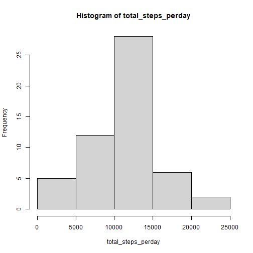
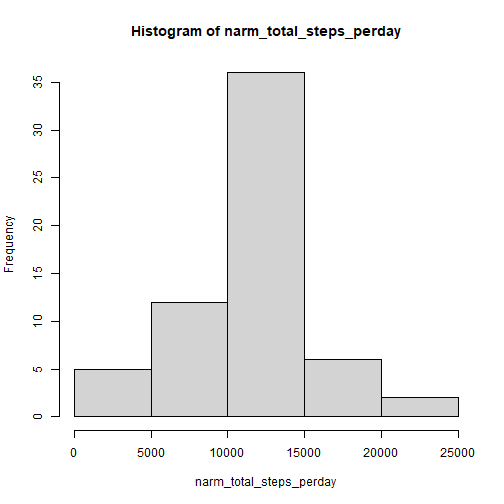

# Loading and preprocessing the data
### Read data from computer

```r
activity <- read.csv('D:\\Coursera\\Reproducible_Research\\A1/activity.csv')
```

### Check a part of data

```r
head(activity)
```

```
##   steps       date interval
## 1    NA 2012-10-01        0
## 2    NA 2012-10-01        5
## 3    NA 2012-10-01       10
## 4    NA 2012-10-01       15
## 5    NA 2012-10-01       20
## 6    NA 2012-10-01       25
```

# What is mean total number of steps taken per day?
### Calculate the total number of steps taken per day

```r
total_steps_perday <- tapply(activity$steps, activity$date, sum)
head(total_steps_perday)
```

```
## 2012-10-01 2012-10-02 2012-10-03 2012-10-04 2012-10-05 2012-10-06 
##         NA        126      11352      12116      13294      15420
```

### Drawing the histogram

```r
hist(total_steps_perday)
```



### Calculate and report the mean and median of the total number of steps taken per day

```r
mean_steps <-mean(total_steps_perday, na.rm=T)
median_steps <- median(total_steps_perday, na.rm=T)
```
The mean of total number of steps taken per day is 1.0766189 &times; 10<sup>4</sup>.
The median of total number of steps taken per day is 10765.

# What is the average daily activity pattern?
### Calculate the average number of steps taken per interval

```r
avg_steps_interval <- aggregate(steps~interval, data=activity, mean, na.rm=TRUE)
```

### Plot

```r
plot(steps~interval, data=avg_steps_interval, type="l")
```


###Find which 5-minute interval contains the maximum number of steps

```r
max_steps_interval <- avg_steps_interval$interval[which.max(avg_steps_interval$steps)]
```
When interval equals to 835, it has the maximum number of steps.

# Imputing missing values

### Calculate and report the total number of missing values in the dataset

```r
sum(is.na(activity$steps))
```

```
## [1] 2304
```


### Remove missing values with the mean for that 5-minute interval

```r
for (i in 1:length(activity$steps)){
  if (is.na(activity$steps[i])==1){
    index <- which(avg_steps_interval$interval==activity$interval[i])
    activity$steps[i] <- avg_steps_interval$steps[index]
  }
}
```

### Check the total number of missing values in the dataset

```r
sum(is.na(activity$steps))
```

```
## [1] 0
```


### After NA removal process, calculating the total number of steps taken per day

```r
narm_total_steps_perday <- tapply(activity$steps, activity$date, sum)
```

### Drawing the histogram

```r
hist(narm_total_steps_perday)
```



### Calculate and report the mean and median of the total number of steps taken per day after removing NAs

```r
new_mean_steps <-mean(narm_total_steps_perday, na.rm=T)
new_median_steps <- median(narm_total_steps_perday, na.rm=T)
```
The new mean value is 1.0766189 &times; 10<sup>4</sup> and  the median value is 1.0766189 &times; 10<sup>4</sup>. 

The mean doesn't change and the median value slightly changed(less than 0.01%).

# Are there differences in activity patterns between weekdays and weekends?
### Creating an new column to indicate weekday and weekend

```r
activity$weekday <- ifelse(weekdays(as.Date(activity$date)) %in% c("Saturday", "Sunday"), "weekend", "weekday")
```

### Make a panel plot

```r
library(lattice)
new_avg_steps_interval <- aggregate(steps~interval+weekday, data=activity, mean, na.rm=TRUE)
xyplot(steps~interval|weekday,data=new_avg_steps_interval,type = "l",layout=1:2, ylab = 'Number of steps')
```


Yes, there are differences in activity patterns between weekdays and weekends.
